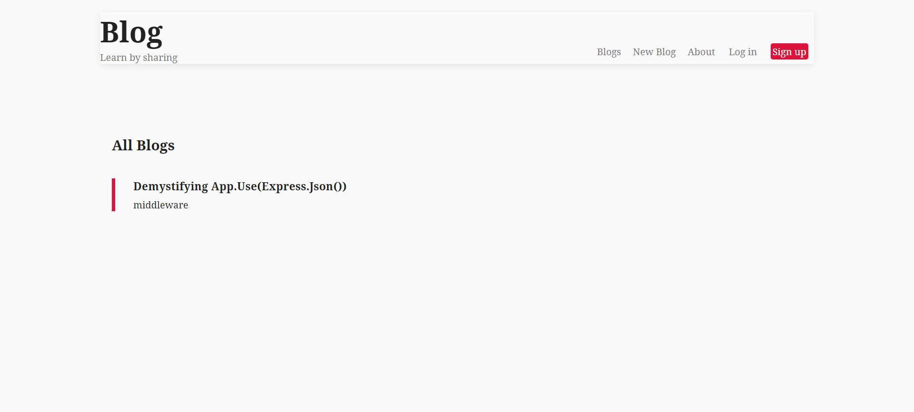
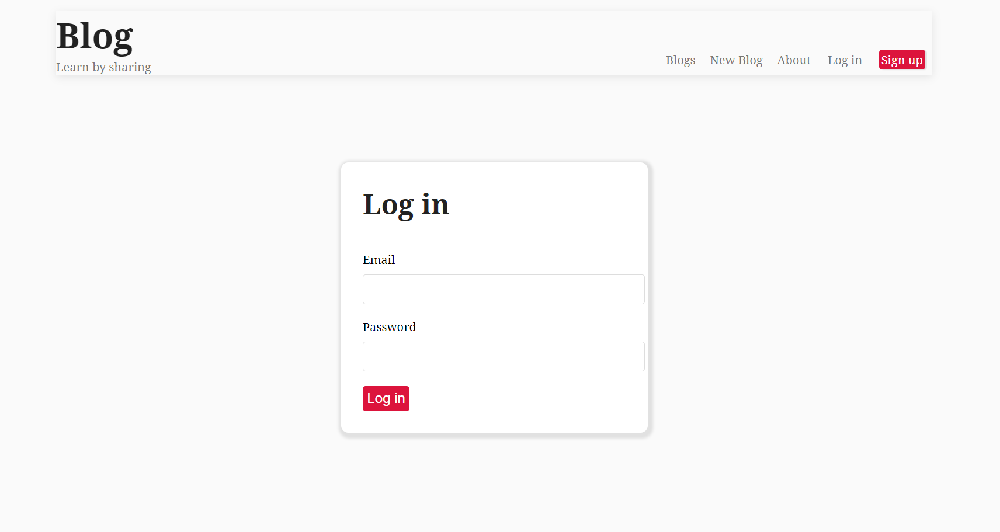

# Blog App

Blog app is developed using Nodejs and ejs template providing CRUD operations to the client. User can view, add, delete (their own) blogs using this app.


## Screenshots




## Run Locally

Clone the project

```bash
  git clone https://github.com/Rishabh-D/blog-app.git
```

Go to the project directory

```bash
  cd Blog App
```

Install dependencies

```bash
  npm install
```

Start the server

```bash
  npm run start
```

## API Reference

## mongodb is used to store the database of blogs

##### dbURI : "mongodb+srv://<user>:<password>@cluster0.9vvbp.mongodb.net/<database-name>"

make above changes in the app.js to register your own mongodb database


